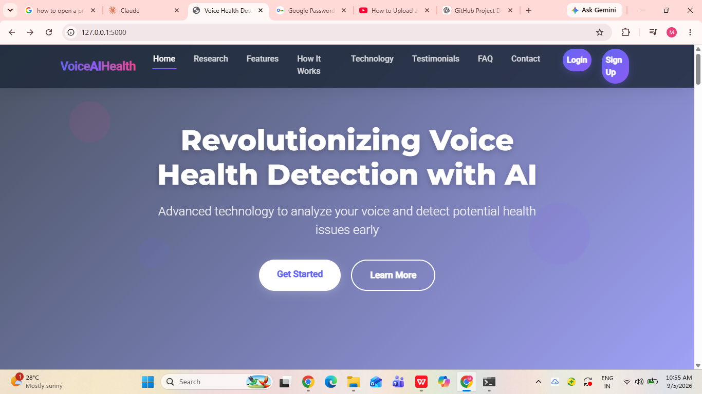
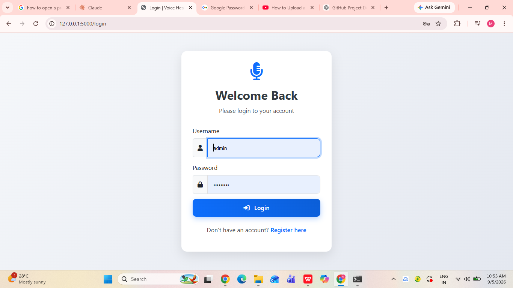
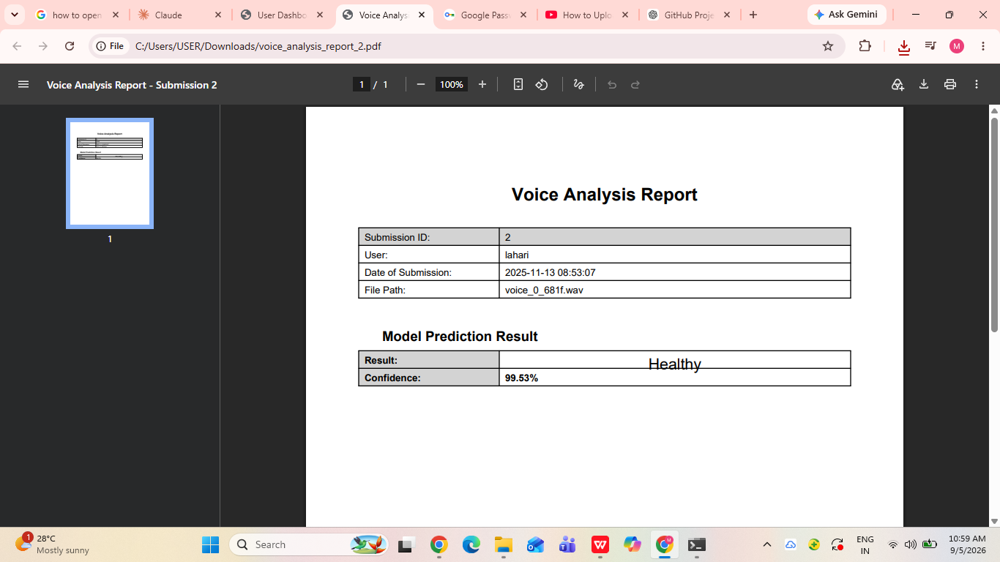
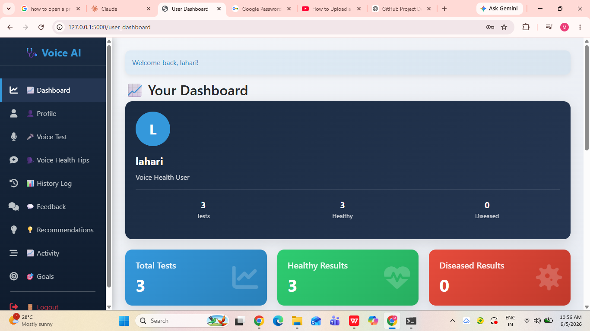
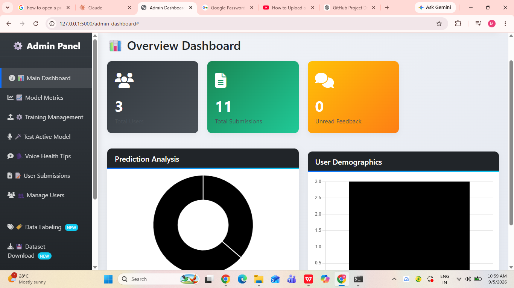
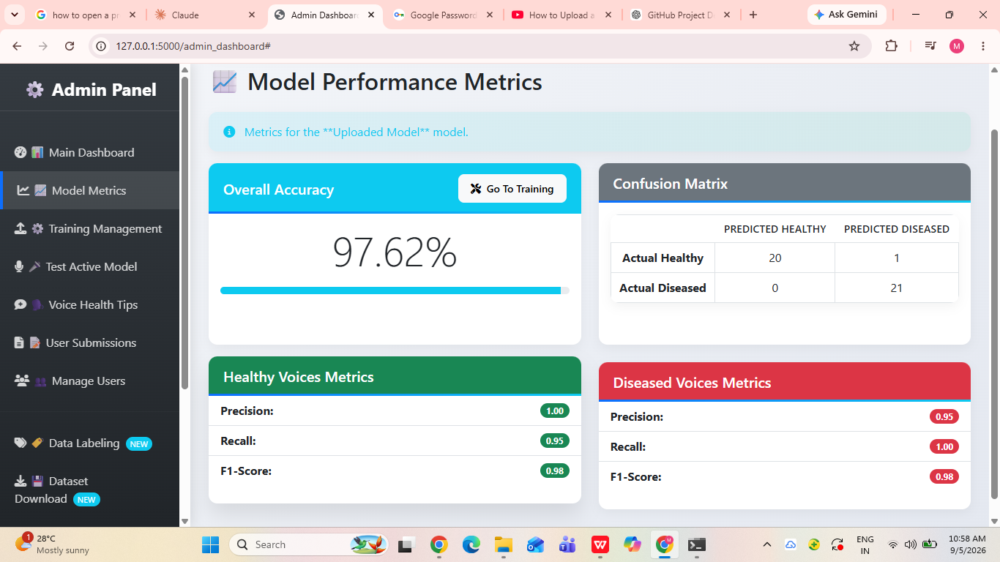

# 🎙️ Detecting Throat Cancer from Speech Signals Using Machine Learning

## 📌 About the Project

This project is a **web-based speech analysis application** developed using Python, Flask, and Deep Learning to classify speech signals into two categories:

* **Normal**
* **Potential Throat Cancer**

The application accepts an audio sample, processes the speech signal, extracts a mel-spectrogram representation, and uses a trained **CNN-BiLSTM deep learning model** to generate a classification result.

The project also includes user authentication, user dashboards, prediction history, report generation, administrative functionality, and performance monitoring.

> ⚠️ **Disclaimer:** This project is developed for academic and research purposes only. It is not intended to replace professional medical diagnosis or medical advice.

---

## 🎯 Objectives

* Analyze speech signals for patterns associated with throat cancer.
* Preprocess uploaded speech recordings.
* Convert speech signals into suitable audio representations for model prediction.
* Apply a CNN-BiLSTM deep learning model for classification.
* Provide a simple web interface for speech analysis.
* Allow users to view and manage their prediction results.
* Provide administrative features for monitoring application activity.
* Generate reports based on prediction results.

---

## 🔍 Problem Statement

Changes in voice characteristics can occur due to several conditions, including disorders affecting the throat and vocal system.

This project explores whether speech signals can be used as a **non-invasive screening approach** for identifying patterns that may be associated with throat cancer.

The system is intended as an academic demonstration of applying **speech processing, machine learning, deep learning, and web application development** to a healthcare-related problem.

---

## 💡 Proposed Solution

The application follows this general workflow:

```text
                🎙️ Speech Input
                       │
                       ▼
              🔊 Audio Preprocessing
                       │
                       ▼
              📊 Mel-Spectrogram
                       │
                       ▼
              🧠 CNN-BiLSTM Model
                       │
                       ▼
                 Classification
                       │
                       ▼
                📋 Result Display
                       │
                       ▼
                 📄 PDF Report
```

The uploaded audio is processed and converted into a fixed-size mel-spectrogram representation before being passed to the trained deep learning model.

---

## ✨ Key Features

### 🎙️ Speech Analysis

* Upload speech/audio samples.
* Process audio files using Librosa.
* Normalize and prepare audio for prediction.
* Convert speech into mel-spectrogram features.

### 🧠 Machine Learning / Deep Learning

* CNN-BiLSTM based classification model.
* TensorFlow-based model prediction.
* Feature normalization using stored statistical parameters.
* Classification into Normal or Potential Throat Cancer.

### 👤 User Features

* User registration and login.
* User dashboard.
* Speech submission.
* Prediction history.
* View prediction results.
* Download generated reports.
* Manage profile information.
* Update password.
* Manage notes and submissions.

### 👨‍💼 Admin Features

* Administrative dashboard.
* User management.
* Submission monitoring.
* Activity tracking.
* Feedback management.
* Performance monitoring.

### 📊 Reporting & Monitoring

* Prediction result generation.
* PDF report generation.
* Performance metrics.
* Application activity tracking.
* Notification functionality.

---

## 🧠 Machine Learning Approach

### 1. Audio Preprocessing

The application prepares the uploaded speech recording before prediction.

The preprocessing pipeline includes:

* Loading the audio file.
* Trimming unnecessary silence.
* Normalizing the audio signal.
* Converting the audio into a mel-spectrogram.
* Converting the spectrogram to a decibel scale.
* Padding or truncating the representation to a fixed length.

### 2. Feature Representation

The implemented prediction pipeline uses a **mel-spectrogram** representation.

The application uses:

* Sample rate: **16,000 Hz**
* Number of mel bands: **64**
* Maximum sequence length: **160**

The extracted features are normalized using stored feature mean and standard deviation values before being passed to the model.

### 3. Deep Learning Model

The project uses a **CNN-BiLSTM architecture**.

* **CNN** layers learn spatial patterns from the speech feature representation.
* **Bi-LSTM** layers learn temporal patterns from the sequence.
* The final layers generate the classification prediction.

### 4. Classification

The system produces one of the following outcomes:

```text
Normal
```

or

```text
Potential Throat Cancer
```

> ⚠️ The prediction is an academic machine-learning output and should not be interpreted as a clinical diagnosis.

---

## 🛠️ Technologies Used

| Category             | Technologies               |
| -------------------- | -------------------------- |
| Programming Language | Python                     |
| Web Framework        | Flask                      |
| Authentication       | Flask-Login                |
| Deep Learning        | TensorFlow / CNN / Bi-LSTM |
| Audio Processing     | Librosa                    |
| Numerical Computing  | NumPy                      |
| Machine Learning     | Scikit-learn               |
| PDF Generation       | ReportLab                  |
| Frontend             | HTML, CSS, JavaScript      |
| Development Tools    | VS Code / Jupyter Notebook |
| Version Control      | Git / GitHub               |

---

## 📂 Project Structure

```text
Throat-Cancer-Detection-Using-Speech-Signals-and-Machine-Learning/
│
├── ml_models/
│   └── final_cnn_bilstm.h5
│
├── ml_models_up/
│   └── updated_cnn_bilstm.h5
│
├── screenshots/
│   ├── Admin_Dashboard.png
│   ├── Home.png
│   ├── Login_Page.png
│   ├── Performance_Metrics.png
│   ├── Result.png
│   └── User_Dashboard.png
│
├── static/
│   ├── css/
│   ├── js/
│   └── images/
│
├── templates/
│   └── HTML templates
│
├── app.py
├── requirements.txt
├── .gitignore
└── README.md
```

---

## ⚙️ Installation & Setup

### Prerequisites

Make sure the following are installed:

* Python 3.x
* pip
* Git

### 1. Clone the Repository

```bash
git clone https://github.com/munagalamounika2004/Throat-Cancer-Detection-Using-Speech-Signals-and-Machine-Learning.git
```

Navigate to the project directory:

```bash
cd Throat-Cancer-Detection-Using-Speech-Signals-and-Machine-Learning
```

### 2. Create a Virtual Environment

#### Windows

```bash
python -m venv venv
venv\Scripts\activate
```

#### macOS / Linux

```bash
python3 -m venv venv
source venv/bin/activate
```

### 3. Install Dependencies

```bash
pip install -r requirements.txt
```

---

## ▶️ Running the Application

Start the Flask application:

```bash
python app.py
```

The application will run on the local Flask server.

Open the URL displayed in your terminal, typically:

```text
http://127.0.0.1:5000/
```

---

## 📊 Application Workflow

```text
User
 │
 ▼
Login / Registration
 │
 ▼
User Dashboard
 │
 ▼
Upload Speech
 │
 ▼
Audio Processing
 │
 ▼
Mel-Spectrogram Feature Extraction
 │
 ▼
CNN-BiLSTM Model
 │
 ▼
Prediction
 │
 ├── Normal
 │
 └── Potential Throat Cancer
 │
 ▼
View Result
 │
 ▼
Generate / Download Report
```

---

## 🖼️ Screenshots

### 🏠 Home Page



### 🔐 Login Page



### 📊 Prediction Result



### 👤 User Dashboard



### 👨‍💼 Admin Dashboard



### 📈 Performance Metrics



---

## 🔐 Security

The application includes security-related functionality such as:

* User authentication.
* Password management.
* Login/session handling.
* Secure handling of uploaded files.
* Input validation.
* Activity and security logging.
* Protection of sensitive configuration information.

> Never upload passwords, API keys, database credentials, or other secrets to GitHub.

---

## ⚠️ Limitations

* Speech characteristics can vary significantly between individuals.
* Recording quality and environmental noise can affect predictions.
* Model performance depends on the quality and diversity of the training data.
* A machine-learning prediction cannot replace clinical examination.
* The model requires further validation before any real-world medical application.
* The project is intended for academic and research purposes.

---

## 🚀 Future Enhancements

Possible improvements include:

* Larger and more diverse speech datasets.
* Improved model generalization.
* Real-time speech analysis.
* Model performance optimization.
* Explainable AI techniques.
* Additional acoustic features.
* Improved visualization of model predictions.
* Cloud deployment.
* Integration with additional healthcare data sources.
* Extensive clinical validation.

---

## 🎓 Academic Project

**Project:** Detecting Throat Cancer from Speech Signals Using Machine Learning

**Degree:** Bachelor of Technology – Information Technology

**Institution:** Sri Devi Women's Engineering College

**Academic Year:** 2025–2026

---

## 📜 Disclaimer

This project is developed for **academic and research purposes only**.

The predictions generated by this application should **not be considered a medical diagnosis or medical advice**. Any suspected health condition should be evaluated by a qualified healthcare professional using appropriate clinical diagnostic procedures.

---

## ⭐ Project Highlights

This project demonstrates practical experience with:

* Python
* Flask
* TensorFlow
* CNN-BiLSTM
* Speech Processing
* Librosa
* Machine Learning
* Web Application Development
* User Authentication
* Database Integration
* PDF Report Generation
* Git & GitHub

---

**Built as an academic project to explore the application of Machine Learning and Speech Processing in healthcare.**
